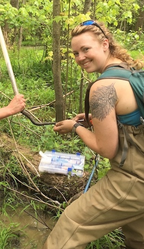

 

**Abbreviated Curriculum Vitae**
 
**Publications** 

 
**Richard, M.A.**, S. Elliott, S.L. Hummel, D.A. Woolnough, L.D. Rzodkiewicz, S.P. Gill, J. Rappold, and M.L. Annis. 2024. Reduced freshwater mussel juvenile production as a result of agricultural and urban contaminant mixture exposures. Environmental Toxicology and Chemistry. *In Review*  
Moniz, H.A., **M.A. Richard**, C.M. Gienger, and C.R. Feldman. 2021. Assessing metabolic costs of toxin resistance in garter snakes (Thamnophis). Integrative Zoology. https://doi.org/10.1111/1749-4877.12574

**Poster and Oral Presentations**

 
**Richard, M.** 2020. Plasma corticosterone mediates metabolic rate in Cottonmouth snakes. Thesis Defense Seminar. (Presentation) 
**Richard, M.** and C.M. Gienger. 2020. Stress and Metabolism: Linking Corticosterone and Standard Metabolic Rate in Cottonmouth Snakes. Southeastern Partners in Amphibian and Reptile Conservation Conference. (Poster) 
**Richard, M.** and C.M. Gienger. 2019. Standard Metabolism and Energetics of Ecdysis in Cottonmouth Snakes. Joint Meeting of Ichthyologists and Herpetologists. (Poster)

**Education**
 

**Austin Peay State University** | Clarksville, Tennessee | August 2018 – August 2020 
 
Master of Science: Biology, GPA: 4.00/4.00	 
[Thesis](https://mollyarichard.github.io/AgPi-SMR-Prelim/) studied the relationship between stress and metabolism in Cottonmouths. 
 
**Iowa State University** | Ames, Iowa |	August 2010 - December 2014
 
Bachelor of Science: Animal Ecology, GPA: 3.05/4.00
 
Secondary Major: Environmental Studies
