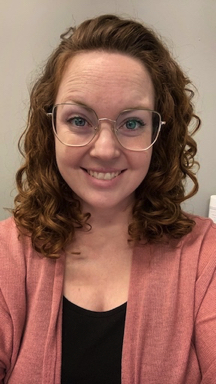
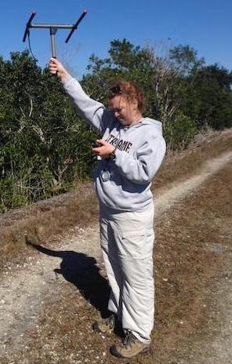
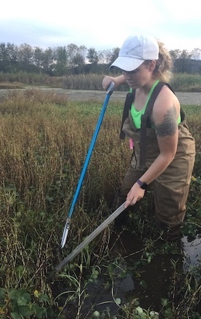
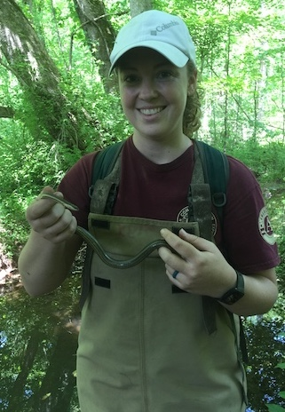

::: {style="float:right ;position: relative;  "}

:::
 
 

**Molly A. Conway, M.S.** I currently work for the the USGS at the Upper Midwest Water Science Center in the Michigan Bacteriologic Research Laboratory ([MIBaRL](https://www.usgs.gov/programs/environmental-health-program/science/bacteriological-research-lansing-michigan)) in Lansing, Michigan. My role includes analyzing environmental samples for harmful bacteria via molecular methods(e.g., DNA extraction, PCR). In addition to my role in the lab, I also spend time analyzing a variety of biological data and creating scientific products.
 
 

I am an intermediate R coder. I have experience running parametric and non-parametric statistics, linear and non-linear models, mixed models, diversity analyses, community ordination, and creating graphs to visualize data. My [Github](https://github.com/MollyARichard) has a subset of my coding experience. I love Github, especially when collaborating, and will sing its praises at any given chance. I enjoy all aspects conducting research: data collection in the field and lab, statistical analysis, and even writing. Admittedly, those components prove to be increasingly more difficult as you move down the list, but I like a good challenge.
 
 
Living in lower-mitten-Michigan which gives me lots of opportunities to spend time outdoors enjoying some of my favorite things: herping, birding, fishing, kayaking, and camping.      
 
 

::: {style="float:right;position: relative; "}

:::

::: {style="float:left ;position: relative;  "}

:::

::: {style="float:center; position: relative; right -60px"}

:::

